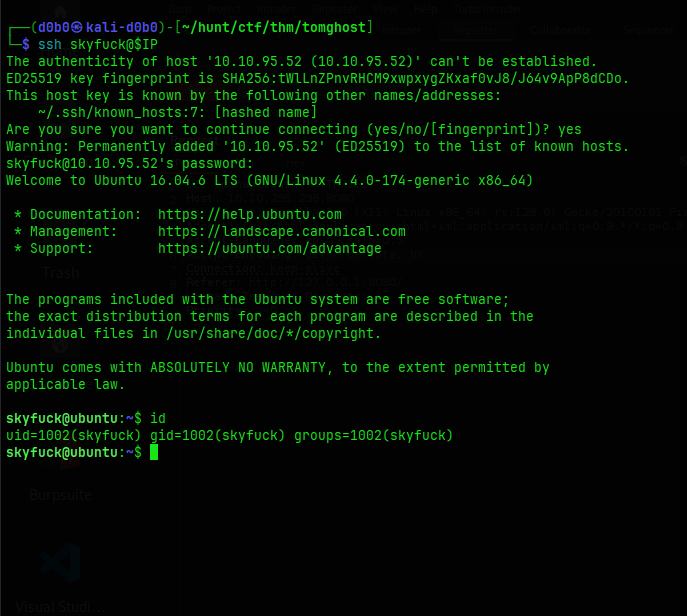
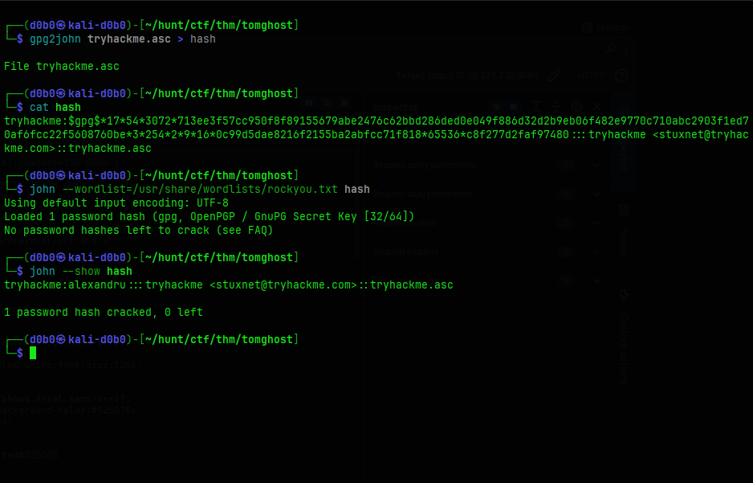
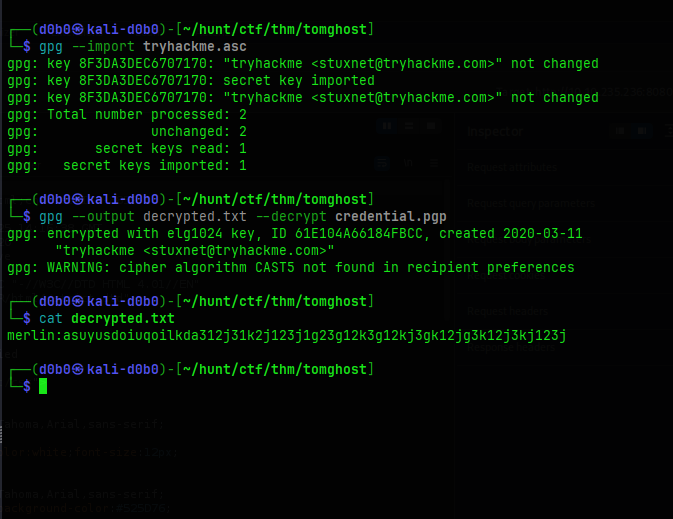
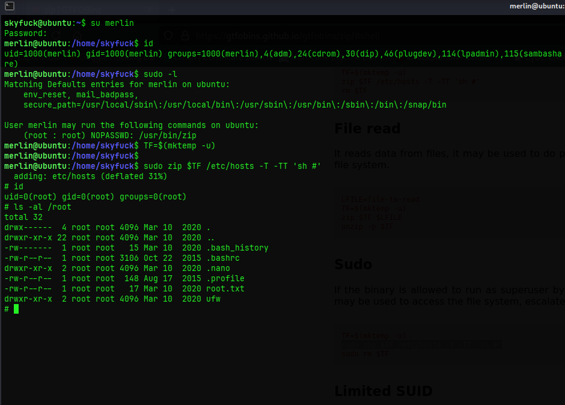

# Tomghost

**Hostname:**
`10.10.95.52`

**OS:**
`Linux`

**Users:**

```
skyfuck
merlin
```

**Credentials:**

```
skyfuck:8730281lkjlkjdqlksalks
merlin:asuyusdoiuqoilkda312j31k2j123j1g23g12k3g12kj3gk12jg3k12j3kj123j
```

## Port Scan:

```
PORT     STATE SERVICE    VERSION
22/tcp   open  ssh        OpenSSH 7.2p2 Ubuntu 4ubuntu2.8 (Ubuntu Linux; protocol 2.0)
| ssh-hostkey: 
|   2048 f3:c8:9f:0b:6a:c5:fe:95:54:0b:e9:e3:ba:93:db:7c (RSA)
|   256 dd:1a:09:f5:99:63:a3:43:0d:2d:90:d8:e3:e1:1f:b9 (ECDSA)
|_  256 48:d1:30:1b:38:6c:c6:53:ea:30:81:80:5d:0c:f1:05 (ED25519)
53/tcp   open  tcpwrapped
8009/tcp open  ajp13      Apache Jserv (Protocol v1.3)
| ajp-methods: 
|_  Supported methods: GET HEAD POST OPTIONS
8080/tcp open  http       Apache Tomcat 9.0.30
|_http-favicon: Apache Tomcat
|_http-title: Apache Tomcat/9.0.30
Service Info: OS: Linux; CPE: cpe:/o:linux:linux_kernel
```


## Recon:

Port 8080
- Apache Tomcat 9.0.30
- Vulnerable to CVE-2020-1938 affecting the Apache JServ Protocol
- Remote File Read/Inclusion


## Foothold / Privilege Escalation:

### Initial Foothold

I got initial access due to the Remote File Read vulnerability in Apache Tomcat, with the vulnerability I was able to read /opt/tomcat/webapps/ROOT/WEB-INF/web.xml which contained user credentials for the user skyfuck.
- I could not find a working python exploit so I used the metasploit module:
	- `auxiliary/admin/http/tomcat_ghostcat`


Since the SSH port was open I could login with the found credentials.



---

### Privilege Escalation:

As the user skyfuck I wasnt able to do much, but in the home directory I found a pgp encrypted file with the decryption key.

I used scp to transfer both files to my machine and the used a tool called gpg2john to extract the hash from the decryption key.


I am doing this since importing and decrypting the file requires a password which is contained inside this hash that gpg2john will extract.

After extracting I used john the ripper to crack the hash and decrypt the file which contained credentials for the user merlin.
- The cracked hash is the passphrase for the gpg decryption key





As the user merlin I could run sudo without the use of the password on the /usr/bin/zip binary, and a search on gtfobins describes the steps to take for escalating privileges to root.




## Journal:
- Tomcat xml configuration: `tomcat/webapps/ROOT/WEB-INF/`